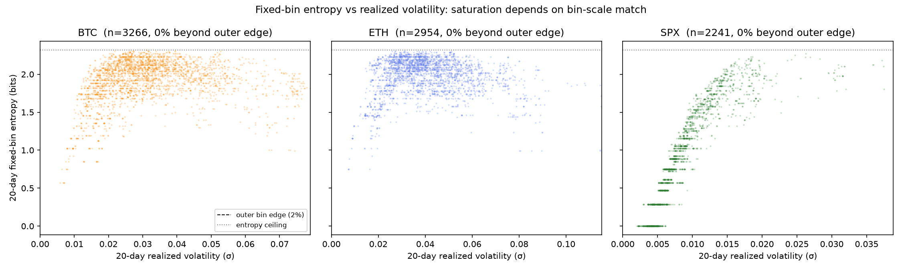
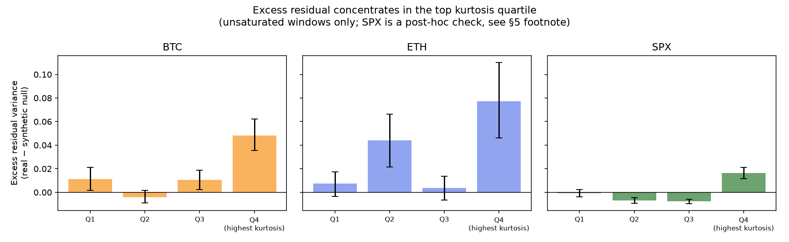

# Fixed-Bin Shannon Entropy of Returns Is a Bin-Scale-Dependent Re-Encoding of Realized Volatility

**Status: Phase 1 of 3 (pillar A only). Not a complete study.** Pillars B (incremental
predictive information) and D (propagation audit) are not yet done — see Status.

**Pre-registration:** [OSF DOI/link — https://osf.io/2yh7d]
**Code:** [GitHub repo — https://github.com/Naradararin/entropy-volatility-artifact]
**Author:** [Thitiphoom Pannarin]

---

## TL;DR

For Gaussian returns, differential entropy is a strictly monotone function of σ
(`h = ln(σ√(2πe))`), so a fixed-bin Shannon entropy feature is expected to carry
little information beyond realized volatility. We quantify this directly rather
than assuming it. The result is more specific than "entropy equals volatility":
**whether the collapse is visible in the correlation depends entirely on whether
the bin edges are scaled to the asset's typical volatility.** On an asset where
they are (S&P 500), entropy and volatility are almost perfectly linked
(Spearman ρ = 0.96). On assets where they are not (BTC, ETH), the naive
correlation is low or even negative — not because the two are independent, but
because entropy saturates near its ceiling for most of the sample. A
pre-registered synthetic-null test, run per-asset after fixing two implementation
bugs that would otherwise have given the opposite conclusion, shows that in the
*unsaturated* tail of BTC and SPX, entropy does carry real information beyond σ,
concentrated specifically in the highest-kurtosis regime. ETH shows a related but
messier pattern that does not fit the same story and is left unexplained.

## 1. Motivation

Feature transforms that quietly re-encode an existing variable, rather than
adding new information, are a recurring failure mode in applied financial
machine learning. A prior study by the same author documented one such case: a
min-max normalization step combined with an argmin scheduling rule that produced
a spurious step-function artifact in a carbon-water co-optimization system,
mistakeable for a genuine decision boundary. Fixed-bin Shannon entropy of returns
is a structurally similar candidate. For a fixed-shape, mean-zero return
distribution, the probability mass in each bin is a function of σ alone, so in
the population limit entropy is an exact, deterministic function of volatility.
The open empirical question is not whether this identity holds in principle —
it does — but how completely it explains what is measured in finite samples on
real markets, and where it breaks down.

## 2. Method

**Assets and period.** BTC-USD, ETH-USD, ^GSPC (S&P 500), daily closes,
2017-01-01 to 2025-12-31 (ETH data begins 2017-11-09, the start of Yahoo
Finance's history for that ticker). Source: yfinance (unofficial Yahoo Finance
API). Data frozen to Parquet with SHA-256 hashes recorded in `data/manifest.json`
before any analysis was run.

**Entropy.** Rolling 20-day plug-in Shannon entropy (bits) on log returns,
discretized into five fixed absolute bins: `(-∞,-2%]`, `(-2%,-1%]`, `(-1%,1%]`,
`(1%,2%]`, `(2%,∞)`. Realized volatility: 20-day rolling sample standard
deviation of log returns, same window alignment.

**Pre-registration.** The claim, ten quantitative predictions with stated
confidence, and decision rules for interpreting the results were frozen and
registered on OSF *before* any data was downloaded — including the rule that a
low correlation must first be checked against saturation and implementation
error before being read as evidence of independence (§5.1–5.3). Two amendments
were logged after freezing, both increasing analytical resolution rather than
changing the underlying question: (1) documenting that the bin edges are
scale-matched to SPX-level volatility and not to crypto-level volatility, and
(2) revising the expectation for a post-hoc SPX sanity check after it
unexpectedly replicated rather than contradicted the main finding. Both are
recorded verbatim in the pre-registration's amendment log.

**Synthetic null.** To separate genuine shape information from small-sample
estimator noise, 1,000 replications per asset simulate Gaussian-innovation
returns whose 20-day rolling σ path matches the empirical path exactly, by
construction carrying no information beyond σ. Entropy is computed identically
on the simulated series, a monotone fit of H on σ is estimated for both real and
simulated data, and residual variance is compared. Excess residual variance
(real − null mean), with a 95% interval over the 1,000 replications, is the
primary evidence — not the raw correlation, which cannot distinguish sampling
noise from saturation from genuine shape information (see §5.1 of the
pre-registration).

**Kurtosis-quartile decomposition.** Within each asset's unsaturated windows
(σ below the outer bin edge), residuals are split into four quartiles by
realized excess kurtosis, with a bootstrap (1,000 resamples) confidence interval
on the excess residual per quartile.

## 3. Result 1 — the correlation depends on bin-scale match, not on independence

| Asset | n | Pearson r | Spearman ρ | Fraction σ > 2% (outer bin edge) | Fraction H pinned at floor/ceiling |
|---|---|---|---|---|---|
| SPX | 2,241 | 0.711 | **0.963** | 3.6% | 14.1% |
| BTC | 3,266 | 0.117 | 0.218 | 79.4% | 0.06% |
| ETH | 2,954 | −0.084 | −0.059 | 93.2% | 0.00% |

SPX's typical daily volatility (median rolling σ ≈ 0.8%) sits almost entirely
inside the ±2% outer bin edge, so entropy remains responsive across nearly the
full range of observed volatility — Spearman ρ = 0.96, matching the
pre-registered prediction for a well-matched asset. BTC's volatility (median
≈ 2.9%) and ETH's (median ≈ 3.8%) both routinely exceed the outer edge, so
entropy is compressed near its ceiling for the large majority of the sample
(79% and 93% of windows respectively) without literally pinning at the exact
maximum value. This produces a *saturation* effect that the naive correlation
under-reads as independence, even though the underlying mechanism —
`H ≈ g(σ)` — has not changed; only its visibility in a linear or rank
correlation has.

**Implication:** applying a single fixed bin scheme across assets with very
different typical volatility, a pattern this study finds evidence of in public
example code (see §7, pending), silently changes what is actually being
measured. A correlation-based redundancy check would report BTC and ETH's
entropy as "not redundant with volatility," when the correct within-sample
statement is closer to "so redundant with volatility that it stops responding."

## 4. Result 2 — the synthetic null separates noise from signal

Two implementation bugs were caught and fixed before these numbers were
trusted, both documented in the analysis scripts: (1) a warm-up misalignment
that silently produced `NaN` in a longer stretch of the simulated series than
the real one; (2) an initial version that compared each replication's entropy
against the *target* σ used to generate it (noise-free) rather than that
replication's own *re-estimated* rolling σ (equally noisy as the real
estimate) — an asymmetric comparison that inflated the apparent null residual
variance roughly fivefold and would have supported the opposite conclusion.

| Asset | Subsample | n | Var(resid, real) | Null mean [95% CI] | Excess | Outside null CI? |
|---|---|---|---|---|---|---|
| BTC | full | 3,247 | 0.0478 | 0.0388 [0.0310, 0.0470] | +0.0090 | yes |
| BTC | saturated | — | 0.0427 | 0.0416 [0.0327, 0.0517] | +0.0011 | no |
| BTC | unsaturated | — | 0.0676 | 0.0265 [0.0181, 0.0377] | **+0.0411** | **yes** |
| ETH | full | 2,935 | 0.0423 | 0.0491 [0.0392, 0.0606] | −0.0068 | no |
| ETH | saturated | — | 0.0393 | 0.0503 [0.0402, 0.0621] | −0.0110 | yes (below) |
| ETH | unsaturated | — | 0.0834 | 0.0263 [0.0146, 0.0451] | **+0.0571** | **yes** |
| SPX | full | 2,222 | 0.0268 | 0.0255 [0.0201, 0.0318] | +0.0013 | no |
| SPX | unsaturated | — | 0.0267 | 0.0250 [0.0197, 0.0313] | +0.0017 | no |

Within each asset's saturated regime, real and null residual variance are
statistically indistinguishable — consistent with the collapse being complete
once volatility exceeds what the bins can resolve. In the *unsaturated* tail,
BTC and ETH both show excess residual variance clearly outside the null
interval, while SPX (whose unsaturated subsample is nearly its whole sample)
shows none in the pooled test. This is the first indication that whatever
information entropy carries beyond volatility is not spread evenly across the
sample, motivating the kurtosis decomposition below.

## 5. Result 3 — the excess concentrates in the highest-kurtosis regime

Bootstrap 95% CIs on excess residual variance by kurtosis quartile, unsaturated
windows only:

| Asset | Quartile | n | Excess residual | 95% CI |
|---|---|---|---|---|
| BTC | Q1 (lowest kurtosis) | 168 | +0.0111 | [0.0017, 0.0211] |
| BTC | Q2 | 168 | −0.0042 | [−0.0091, 0.0016] |
| BTC | Q3 | 167 | +0.0106 | [0.0025, 0.0187] |
| BTC | Q4 (highest kurtosis) | 168 | **+0.0482** | **[0.0356, 0.0623]** |
| ETH | Q1 | 51 | +0.0074 | [−0.0035, 0.0174] |
| ETH | Q2 | 50 | +0.0442 | [0.0214, 0.0663] |
| ETH | Q3 | 50 | +0.0037 | [−0.0065, 0.0137] |
| ETH | Q4 | 50 | **+0.0773** | **[0.0462, 0.1101]** |
| SPX† | Q1 | 536 | −0.0007 | [−0.0038, 0.0023] |
| SPX† | Q2 | 535 | −0.0068 | [−0.0092, −0.0045] |
| SPX† | Q3 | 535 | −0.0077 | [−0.0095, −0.0058] |
| SPX† | Q4 | 536 | **+0.0164** | **[0.0116, 0.0212]** |

†SPX was run as a post-hoc sanity check, not part of the original
pre-registered plan, on the expectation that it would serve as a flat negative
control given its near-zero pooled excess residual (§4). It did not: Q4 shows a
clean, well-separated positive excess — directionally replicating BTC on the
asset with the largest per-quartile sample (n ≈ 535, roughly 3× BTC and 10× ETH)
and correspondingly the tightest confidence intervals of any asset tested. This
strengthens rather than weakens the top-quartile concentration finding; it is
logged as a post-hoc test, not counted toward the pre-registered comparison
budget, and the pre-registration's amendment log records that the original
expectation for this check was wrong.

**BTC fits a clean concentration pattern:** Q4's interval does not overlap Q1,
Q2, or Q3 at all. **SPX replicates the same top-quartile-only shape**, with
Q2/Q3 mildly negative rather than near zero — the pooled near-zero result in
§4 is explained by cancellation across quartiles, not by uniform flatness.
**ETH does not fit as cleanly:** both Q2 and Q4 show excess clearly outside
zero, with overlapping intervals, which does not support a single
"only the extreme tail matters" story. This is reported as unresolved rather
than rounded up to match the other two assets.

## 6. Limitations

- **ETH's pattern is not explained.** It is smaller-sample (n=50/quartile vs.
  BTC's 168 and SPX's ~535) and shows a qualitatively different shape
  (bimodal-looking excess rather than top-quartile-only). Both a genuine
  behavioral difference and residual small-sample noise are plausible; this
  study does not distinguish them.
- **Sample sizes vary substantially by asset** (SPX's post-hoc quartiles are
  roughly 3× BTC's and 10× ETH's), which likely explains at least part of why
  BTC and SPX show cleaner CIs than ETH, independent of any true underlying
  difference.
- **Single bin scheme, single window length.** All results use the frozen
  20-day window and the specific fixed bins in the pre-registration. Whether
  the qualitative pattern (saturation dominates; residual shape information
  concentrates at high kurtosis) holds under other reasonable choices is not
  tested here.
- **This is not a predictive-value claim.** Nothing here shows entropy improves
  any forecast. It shows where entropy carries information beyond σ in-sample;
  whether that information is exploitable is pillar B, not yet done.
- **Correlational, not causal**, in every sense — no claim is made about market
  microstructure or investor behavior producing these patterns.
- Data source (yfinance) is an unofficial API; exact historical values may
  differ from primary exchange data by small amounts.

## 7. Status and what is not yet done

This document covers **pillar A only** of a four-pillar pre-registered plan:

- [x] **A — Quantification.** This document.
- [ ] **B — Incremental information.** Does entropy improve out-of-sample
      prediction of future volatility or returns, conditional on current σ?
      Not started.
- [x] *(partial, folded into A)* **C — Estimator bias.** The synthetic null and
      saturation analysis substantially cover this; a dedicated Miller-Madow /
      shrinkage-estimator comparison is not yet written up separately.
- [ ] **D — Propagation audit.** Whether public trading tools/repositories
      compute fixed-bin entropy alongside volatility as though the two were
      independent. Not started.

All numbers in this document are traceable to `experiments/registry.jsonl` in
the linked repository and were computed by scripts under `scripts/`, using pure
functions in `src/features/` that are independently tested against
hand-computed fixtures in `fixtures/` (41/41 tests passing at time of writing).
